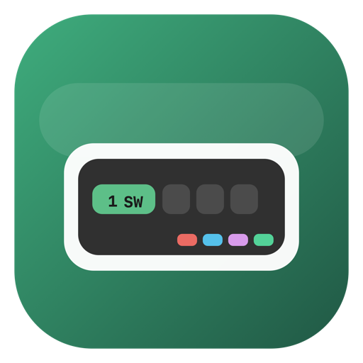

# SmartWindow

<p align="center">
  <a href="https://github.com/kevnnard/smart-window/releases/tag/v0.1.2">
    
  </a>
  <a href="https://github.com/kevnnard/homebrew-tap">
    
  </a>
  <a href="./LICENSE">
    
  </a>
</p>

<p align="center">
  
</p>

<p align="center">
  SmartWindow is a macOS menu bar replacement inspired by Polybar and Waybar, built for faster window switching and a cleaner tiling-WM-like workflow on Apple desktops.
</p>

<p align="center">
  
</p>

<p align="center">
  
</p>

Current public release: `v0.1.2`

## Why SmartWindow?

macOS gives you powerful apps, but window switching still feels slower and less legible than it should.

SmartWindow puts the information you actually need at the top of every screen:

- numbered tabs for open windows, so switching feels immediate instead of fuzzy
- direct click-to-focus behavior, plus keyboard shortcuts for fast muscle-memory workflows
- system status and now playing info in the same bar, without living in the Dock or a crowded native menu bar
- per-monitor behavior that feels closer to a lightweight window manager than a typical utility app

If you like the clarity of Polybar, Waybar, or tiling WM status bars but want to stay on macOS, SmartWindow is built for that gap.

## Highlights

- Numbered window tabs like `1 · Finder`, `2 · Ghostty`, `3 · Brave`
- Click any tab to focus that window
- Global shortcuts for switching windows and toggling the bar
- GPU, CPU, RAM, volume, mic, date, and battery indicators
- Now Playing support for Spotify / Apple Music style media playback
- Multi-monitor support
- Per-screen fullscreen hiding
- Blur / glass-style top bar background
- Menu bar utility app with no Dock icon

## Keyboard Shortcuts

| Shortcut | Action |
| --- | --- |
| `Option + Escape` | Show / hide SmartWindow |
| `Option + ]` | Focus next window |
| `Option + [` | Focus previous window |
| `Option + 1-9` | Focus tab by number |

## Requirements

- macOS 13 or newer
- Accessibility permission enabled for SmartWindow
- Apple Silicon and Intel should both work, but the project is currently developed primarily on Apple Silicon macOS beta builds

## What It Does

SmartWindow creates a floating `NSPanel` above the native menu bar area and keeps it visible across Spaces.

In `v0.1.2`, it:

- replaces the visual top bar with a custom blurred overlay
- detects open windows through the macOS Accessibility API
- lets you switch windows by clicking tabs or using hotkeys
- supports multiple screens with one bar per monitor
- hides only the affected bar when an app enters fullscreen on one monitor
- shows the current playing track when media is active
- includes a menu bar dropdown and a polished settings window

## Install With Homebrew

SmartWindow is distributed as a Homebrew Cask.

```bash
brew tap kevnnard/tap
brew install --cask smartwindow
```

If you already tapped the repo and want upgrades later:

```bash
brew update
brew upgrade --cask smartwindow
```

To uninstall:

```bash
brew uninstall --cask smartwindow
```

Notes:

- this installs `SmartWindow.app` into `/Applications`
- on first launch, macOS may ask you to approve the app and grant Accessibility access
- Homebrew uses the GitHub release artifact for `v0.1.2`

## Running From Source

```bash
swift build
swift run
```

## Install As An App

This repo includes a small installer script that builds a release bundle and copies it into `/Applications`.

```bash
./scripts/install-app.sh
```

That installs:

```text
/Applications/SmartWindow.app
```

If macOS warns you the first time, open it manually from Finder and approve it in Privacy & Security if needed.

## Permissions

SmartWindow needs Accessibility access in order to:

- read open windows
- detect focused windows
- switch and raise windows
- read titles and positions
- react to fullscreen state

Grant it at:

`System Settings -> Privacy & Security -> Accessibility`

## Project Structure

```text
.
├── Package.swift
├── README.md
├── LICENSE
├── Resources/
│   ├── AppIcon.icns
│   └── Info.plist
├── Sources/
│   ├── App/
│   │   └── SmartWindowApp.swift
│   ├── Models/
│   │   ├── AppSettings.swift
│   │   └── WindowInfo.swift
│   ├── Services/
│   │   ├── AccessibilityService.swift
│   │   ├── HotKeyService.swift
│   │   ├── NowPlayingService.swift
│   │   ├── SystemMonitorService.swift
│   │   └── WindowManager.swift
│   └── Views/
│       ├── Components/
│       │   ├── MiniTabView.swift
│       │   └── SystemInfoView.swift
│       ├── MenuBarView.swift
│       ├── OverlayPanel.swift
│       ├── SettingsView.swift
│       └── TabBarView.swift
└── scripts/
    ├── build-release-zip.sh
    ├── install-app.sh
    └── release-homebrew.sh
```

## Maintainer Release Flow

To publish a new version and update the Homebrew cask in one step:

```bash
./scripts/release-homebrew.sh 0.1.2 "Release notes here"
```

What it does:

- builds a fresh `SmartWindow.zip`
- signs the app if `SMARTWINDOW_CODESIGN_IDENTITY` is set
- notarizes and staples the app if `SMARTWINDOW_NOTARY_PROFILE` is set
- computes the new SHA256
- pushes the current repo
- creates or updates the GitHub release tag
- updates `kevnnard/homebrew-tap`
- commits and pushes the cask update

Notes:

- run it from a clean git working tree
- it expects the tap repo to exist locally as a sibling directory: `../homebrew-tap`

Recommended for stable Accessibility / window-management permissions across updates:

```bash
export SMARTWINDOW_CODESIGN_IDENTITY="Developer ID Application: Your Name (TEAMID)"
export SMARTWINDOW_NOTARY_PROFILE="smartwindow-notary"
./scripts/release-homebrew.sh 0.1.2 "Release notes here"
```

Create the notary profile once with:

```bash
xcrun notarytool store-credentials "smartwindow-notary" \
  --apple-id "you@example.com" \
  --team-id "TEAMID" \
  --password "app-specific-password"
```

If you only want local signing for development installs, you can set `SMARTWINDOW_CODESIGN_IDENTITY` when running `./scripts/install-app.sh`.

This repo also includes `scripts/release-env.example.sh` so you can copy it to `scripts/release-env.sh`, source it, and keep the signing identity/profile in one place.

## Roadmap

- refine notch-safe layout so tabs never feel cramped or visually shifted
- improve tab overflow behavior when many windows are open
- add real launch-at-login support behind the existing settings toggle
- add richer settings for visual density and bar behavior
- publish follow-up releases after the notch UI is fully dialed in

## License

This project is public and source-available, but commercial use is prohibited.

That means:

- you can use it personally
- you can study it
- you can modify it
- you can share it non-commercially
- you cannot sell it
- you cannot include it in paid/commercial products or services without written permission

See `LICENSE` for the exact terms.
